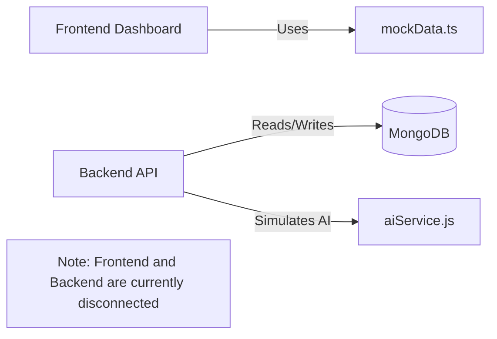

# SkillPulse Project Workflow & Demo Guide

## 1. Project Overview

SkillPulse is a consent-based, longitudinal outcome tracking system for skilling programs. It is designed to help the Government of Maharashtra track what happens to trainees *after* they receive their certificates. 

The complete intended journey is:
Trainee Registration → Training/Enrollment → Certification → Employment → Employer Verification → Follow-up → Retention/Wage Tracking → Government Insights (Dashboard)

## 2. Actual Technology Stack

The project currently uses the following stack:
- **Frontend**: React.js (v19) + Tailwind CSS + Recharts
- **Backend**: Node.js + Express.js
- **Database**: MongoDB + Mongoose
- **Authentication**: JWT (JSON Web Tokens) with Role-Based Access Control
- **AI/Insights**: Mocked JavaScript logic (Node.js/React static data)

*Note: There is no Python or FastAPI code in this repository.*

## 3. Repository Structure

```text
SkillPulse/
├── backend/
│   ├── .env                 # Backend environment variables
│   ├── package.json         # Backend dependencies
│   └── src/
│       ├── controllers/     # API logic (auth, trainee, analytics, etc.)
│       ├── models/          # MongoDB schemas
│       ├── routes/          # API endpoint definitions
│       ├── scripts/         # Database seed scripts (seed.js)
│       └── services/        # Business logic and mock AI methods
├── frontend/
│   ├── .env                 # Frontend environment variables
│   ├── package.json         # Frontend dependencies
│   └── src/
│       ├── components/      # Reusable UI components
│       ├── data/            # Hardcoded mockData.ts (used by frontend)
│       ├── pages/           # Dashboard, AICopilot, Verification, etc.
│       └── services/        # api.ts (currently returns mock data)
└── README.md
```

## 4. Complete Setup From Zero

### Prerequisites
- Node.js (v18+)
- npm
- MongoDB (running locally on port 27017 or a MongoDB Atlas URI)

### Step 1: Clone Repository
```bash
git clone https://github.com/areesh-ahmed/SkillPulse.git
cd SkillPulse
```

### Step 2: Install Frontend Dependencies
```bash
cd frontend
npm install
```

### Step 3: Install Backend Dependencies
```bash
cd ../backend
npm install
```

### Step 4: Environment Variables

**Backend (`backend/.env`)**
```env
PORT=5000
MONGODB_URI=mongodb://127.0.0.1:27017/skillpulse
JWT_SECRET=supersecretjwtkey_for_development_only
JWT_EXPIRE=30d
NODE_ENV=development
```
*Note: Do not use the real MongoDB Atlas URI during public demonstrations if it contains sensitive credentials.*

**Frontend (`frontend/.env`)**
```env
VITE_MOCK_API_DELAY=150
```

### Step 5: Start MongoDB
Ensure your local MongoDB server is running (e.g., using MongoDB Compass or `mongod`).

### Step 6: Seed Database
The backend includes a comprehensive seeder to generate synthetic data.
```bash
cd backend
node src/scripts/seed.js
```
This script wipes the database and creates 3 Providers, 5 Employers, 100 Trainees, and synthetic employment records, courses, and skills. *This data is synthetic and not real government data.*

### Step 7: Start Backend
```bash
cd backend
npm run dev
```
The backend will run on `http://localhost:5000`. You can verify it's running by checking the console logs for "Connected to database".

### Step 8: Start Frontend
```bash
cd frontend
npm run dev
```
The frontend will run on `http://localhost:5173/`. Open this URL in your browser to view the application.

### Step 9: Running Multiple Services
You need two terminals running simultaneously:
- **Terminal 1**: Backend (`npm run dev` in `/backend`)
- **Terminal 2**: Frontend (`npm run dev` in `/frontend`)

## 5. Login / Demo Accounts

**CRITICAL NOTE FOR PRESENTATION:**
The frontend currently **does not have a login screen implemented**. The UI directly opens to the Government Dashboard. 

However, the backend APIs *do* support authentication. If you are demonstrating the API via Postman, you can use the accounts created by the `seed.js` script:

- **Provider**: `provider1@example.com` / `password123`
- **Employer**: `employer1@example.com` / `password123`
- **Trainee**: `trainee1@example.com` / `password123`

*Demo credentials for the frontend UI do not need to be configured, as the frontend bypasses authentication entirely.*

## 6. User Roles

The backend RBAC (Role-Based Access Control) supports the following roles, though currently unlinked from the frontend UI:
- **Government**: Can view aggregated analytics and skill gaps.
- **Training Provider**: Can register trainees, log employment, and view their cohorts.
- **Employer**: Can verify pending employment records.
- **Trainee**: Can view their own profile and manage consent.

## 7. Complete Application Navigation

Since the frontend is not connected to the backend APIs, the following pages are available directly via navigation paths:

- **Government Dashboard**
  - Path: `/`
  - Action: Displays synthetic KPIs (Trainees, Certified, Employment Rate). You can view the District Ranking table and Employment trends.
  - Data: Pulled from `frontend/src/data/mockData.ts`.

- **AI Copilot**
  - Path: `/copilot`
  - Action: Allows typing questions into a chat interface.
  - Interaction: If you type "Nashik", the frontend will return a hardcoded analytical response about Nashik's employment rate.

- **Trainee Profile**
  - Path: `/profile`
  - Action: Displays a hardcoded trainee profile (Aarav Patel) showing career timeline, skills, and current wage.

- **Employer Verification**
  - Path: `/employer/verification`
  - Action: Simulates the magic-link verification screen. 
  - Interaction: Clicking "Verify Employment" instantly turns the status green. It uses hardcoded data for "Rahul Sharma".

*Other routes like `/districts`, `/courses`, `/employment`, `/retention`, and `/skill-gaps` currently show placeholder text.*

## 8. SIH 5-Minute Demo Flow

Because the frontend is a static UI prototype and the backend is a separate functional API, you should focus the visual demo entirely on the frontend UI while speaking to the architecture.

**Step 1 — Government Dashboard**
- **Action**: Open `http://localhost:5173/`
- **Show**: The main KPI dashboard and charts.
- **Say**: "SkillPulse gives policymakers a longitudinal view of what happens after training. We track employment rates, 6-month retention, and median wages across districts."

**Step 2 — AI Copilot Insight**
- **Action**: Click the "Copilot" or navigate to `/copilot`. Type "What is happening in Nashik?" and submit.
- **Show**: The AI Copilot returning the structured response.
- **Say**: "Instead of digging through Excel files, policymakers can ask our AI assistant for insights. The system automatically correlates high attrition in Nashik with a skill mismatch in Data Analytics."

**Step 3 — Trainee Journey**
- **Action**: Navigate to `/profile`.
- **Show**: The longitudinal timeline for Aarav Patel.
- **Say**: "This is the unified longitudinal record. A single ID follows the trainee from enrollment, to certification, to their first job, and tracks their wage progression over time."

**Step 4 — Employer Verification**
- **Action**: Navigate to `/employer/verification`.
- **Show**: The Verification UI. Click "Verify Employment".
- **Say**: "To keep data accurate, we use a frictionless employer verification system. Employers receive a magic link—no account required—and can verify employment status with a single click."

## 9. Feature-by-Feature Workflow

- **Trainee & Course Management**: Fully implemented in backend models/controllers. 
- **Employment & Retention**: Stored via `EmploymentRecord.js` and `WageHistory.js` in MongoDB.
- **Employer Verification**: The backend has API routes (`/api/verification/pending` and `PUT /:id`) but does not actually send emails/SMS. The frontend UI is a static mock.
- **Skill Gap**: The backend uses a mock JavaScript service (`aiService.js`) to generate random skill gap recommendations.
- **Analytics**: The backend `AnalyticsService.js` performs real MongoDB aggregations. The frontend dashboard uses static `mockData.ts`.

## 10. Data Flow



## 11. Database

The actual MongoDB models implemented are:
- `User`: Handles authentication and roles.
- `Trainee`: Core profile, linked to `User`.
- `Course` & `TrainingProvider`: Defines the curriculums.
- `Enrollment`: Links `Trainee` to `Course`.
- `EmploymentRecord`: Logs job placement details.
- `WageHistory`: Tracks salary changes over time.
- `Outcome`: Stores longitudinal tracking scores.
- `Consent`: Tracks privacy opt-ins.
- `EmployerVerification`: Manages the state of verification requests.

## 12. API Reference for Developers

*These APIs exist and work via Postman/cURL, though they are not hooked up to the React frontend.*

| Method | Endpoint | Purpose | Auth/Role |
|---|---|---|---|
| `POST` | `/api/auth/login` | Returns JWT | Any |
| `GET` | `/api/trainees` | Fetch trainees | Gov, Provider, Employer |
| `POST` | `/api/employment` | Log new job | Provider |
| `GET` | `/api/verification/pending` | List pending requests | Employer |
| `GET` | `/api/analytics/government` | Aggregated KPIs | Gov |
| `POST` | `/api/ai/skill-gap` | Mocked AI gap analysis | Gov, Provider |

## 13. What Is Actually Working?

| Feature | Status | Evidence/Location |
|---|---|---|
| Authentication | **PARTIALLY WORKING** | Backend API works (`authController.js`), Frontend has no UI. |
| Dashboard UI | **MOCK/STATIC** | Frontend uses `mockData.ts`. |
| Trainee CRUD | **WORKING** | Backend APIs and Models are fully functional. |
| Employment Tracking | **WORKING** | Backend APIs and Models are fully functional. |
| Employer Verification | **MOCK/STATIC** | Frontend is static; backend lacks email dispatch. |
| Analytics | **PARTIALLY WORKING** | Backend aggregations exist; frontend is disconnected. |
| AI / Insights | **MOCK/STATIC** | Backend uses `Math.random()`, Frontend uses hardcoded strings. |

## 14. Synthetic / Demo Data

- The application uses completely synthetic data generated by `backend/src/scripts/seed.js`.
- It creates 100 fake trainees, 3 providers, and 5 employers.
- The data displayed on the frontend dashboard is **hardcoded** in `mockData.ts` and does not reflect the database seed.

## 15. Common Problems & Fixes

- **Frontend shows nothing but a white screen**: Ensure `npm install` was run in the frontend directory.
- **Backend says "MongooseError"**: MongoDB is not running locally. Start the MongoDB service.
- **Login APIs return 401**: Ensure you are passing the JWT token in the `Authorization: Bearer <token>` header.
- **Dashboard data isn't updating**: The frontend is currently disconnected from the backend and reads from `mockData.ts`. This is expected prototype behavior.

## 16. Presentation Safety (What We Should NOT Claim)

To protect the team during judging, do **NOT** claim the following:
- Do not claim the frontend dashboard is reading live data from the database. (It uses static data).
- Do not claim we have a working Python ML model or NLP running. (It is mocked in Node.js).
- Do not claim emails/SMS are actually being sent to employers.
- Do not claim the frontend has a working login system.

## 17. Judge Questions

**Q: Where is the AI model hosted?**
*Honest Answer:* "For this 48-hour prototype, we designed the system architecture to decouple the AI service, but currently, we are simulating the AI responses using rule-based heuristics in Node.js to demonstrate the user flow. We plan to swap this with a real Python FastAPI microservice post-hackathon."

**Q: Is this real government data on the dashboard?**
*Honest Answer:* "No, all data is synthetic. The frontend is displaying a curated dataset to demonstrate the visual capabilities, while our backend seed script generates 100 synthetic profiles to test our database schemas."

**Q: How does the magic link verification work?**
*Honest Answer:* "The backend generates a secure JWT tied to the employment record. Currently, our API exposes this workflow, though we haven't integrated a live email provider like SendGrid to dispatch the links yet."

## 18. Quick Reference

**START PROJECT**
1. Start MongoDB locally.
2. Terminal 1: `cd backend && npm run dev`
3. Terminal 2: `cd frontend && npm run dev`
4. Open `http://localhost:5173/`

**DEMO FLOW**
1. Overview Dashboard (KPIs)
2. AICopilot (`/copilot` -> Type "Nashik")
3. Trainee Profile (`/profile`)
4. Employer Verification (`/employer/verification`)

**PORTS**
Backend: 5000 | Frontend: 5173 | DB: 27017
