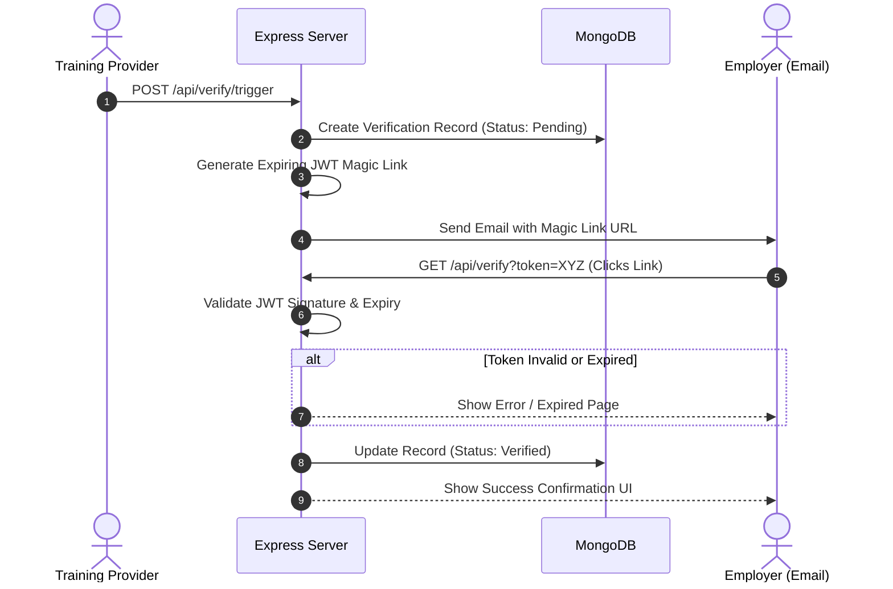

<div align="center">

<br/><br/>

<h1>🚀 SkillPulse</h1>

<p><strong>A consent-based, longitudinal outcome tracking system for skilling programs — built for the Government of Maharashtra.</strong></p>

<br/>


<br/><br/>

</div>

---

## Table of Contents

- [Problem Statement](#problem-statement)
- [Solution Design](#solution-design)
- [System Architecture & Request Flows](#system-architecture--request-flows)
- [Tech Stack](#tech-stack)
- [Project Structure](#project-structure)
- [Key Design Decisions](#key-design-decisions)
- [Environment Configuration](#environment-configuration)
- [Running Locally & Setup](#running-locally--setup)
- [Testing & Quality Assurance](#testing--quality-assurance)
- [API Reference](#api-reference)
- [Security Hardening & Privacy](#security-hardening--privacy)
- [Contributors](#contributors)

---

## Problem Statement

**Problem Statement ID: 26135** | **Organization:** Government of Maharashtra

Current training systems reliably capture enrolment, attendance, assessment, and certification—but fundamentally fail to track long-term outcomes like employment retention, wage progression, and career mobility. Without longitudinal outcome data, assessing the true public value and ROI of skilling investments is nearly impossible.

**SkillPulse** aims to solve this by building a credible, low-burden, privacy-conscious tracking system that tracks a trainee's outcomes over time and turns that raw data into actionable insights for policymakers.

---

## Solution Design

The core insight driving the SkillPulse architecture is **minimizing friction for all stakeholders** while maintaining strict **data privacy**:

- **Frictionless Employer Verification**: Employers do not need to create accounts. Verification requests are sent via magic links (secure, short-lived JWTs) that allow 1-click confirmation of a trainee's employment status.
- **Unified Longitudinal Identity**: A single, unique UUID follows the trainee across multiple courses and employment events over years, preserving macro-analytics integrity even if they change contact details.
- **AI-Driven Skill Gap Analysis**: A decoupled Python/FastAPI service analyzes the delta between course curriculums and employer-required skills, automatically flagging skill gaps in specific districts or cohorts.
- **Privacy First**: Explicit opt-in consent for trainees, with the ability to revoke PII visibility while retaining anonymized macro-level data for government dashboards.

---

## System Architecture & Request Flows

### 1. High-Level Architecture
```mermaid
flowchart TD
    subgraph Frontend Clients
        DASH[React Analytics Dashboard\nPolicymakers]
        PORTAL[React Provider Portal\nTraining Providers]
        EMP[Employer Magic Link UI\nNo-Auth]
    end

    subgraph Backend Core (Node.js)
        API[Express REST API]
        AUTH[JWT Authentication & RBAC]
        AGG[MongoDB Aggregation Service]
    end

    subgraph Intelligence Layer (Python)
        AI[FastAPI ML Service]
        GAP[Skill Gap Analyzer]
    end

    DASH --> API
    PORTAL --> API
    EMP --> API

    API --> AUTH
    API --> AGG
    API <--> AI
    AI --> GAP

    AGG --> DB[(MongoDB\nPrimary Database)]
```

### 2. Employer Verification Flow
Every inbound verification request utilizes an expiring token to remove onboarding friction for employers:



---

## Tech Stack

| Layer | Technology | Purpose |
|---|---|---|
| Backend Framework | Node.js + Express.js | High-throughput REST API and authentication |
| Frontend | React.js + Tailwind CSS | Interactive UIs for Providers and Government |
| Data Visualization| Recharts | Dynamic, aggregated dashboard charts |
| Database | MongoDB + Mongoose | Flexible document storage for complex longitudinal records |
| AI/Intelligence | Python + FastAPI | Skill-gap analysis and predictive modeling (attrition) |
| Auth | Custom JWT (HS256) | Role-Based Access Control (RBAC) and Magic Links |

---

## Project Structure

```text
skillpulse/
|
+-- backend/
|   +-- src/
|   |   +-- controllers/     # Route logic (Auth, Trainee, Analytics)
|   |   +-- models/          # Mongoose Schemas (Trainee, Course, Employment)
|   |   +-- routes/          # Express route definitions
|   |   +-- middleware/      # JWT verification, RBAC, Error handling
|   |   +-- services/        # Business logic & MongoDB aggregations
|   +-- .env                 # Backend configuration
|
+-- frontend/
|   +-- src/
|   |   +-- components/      # Reusable React components
|   |   +-- pages/           # Dashboard, Provider Portal, Magic Link UI
|   |   +-- services/        # Axios API clients
|   +-- tailwind.config.js
|
+-- ai-service/
|   +-- main.py              # FastAPI entry point
|   +-- models/              # ML/NLP models for skill gap analysis
|   +-- requirements.txt     # Python dependencies
|
+-- README.md
```

---

## Key Design Decisions

**Why MongoDB instead of a Relational Database?**
Skilling outcomes are highly variable. A trainee might have multiple overlapping courses, self-employment records, standard employment, and apprenticeship records. MongoDB's document model allows us to store an array of structured outcome events within a single unified Trainee document, making longitudinal queries significantly faster than complex SQL joins.

**Why decouple the AI Service in Python?**
Node.js is excellent for concurrent I/O (handling thousands of dashboard API requests), but Python has superior libraries for NLP and machine learning (scikit-learn, pandas). Decoupling them via a microservice pattern ensures neither system blocks the other and allows independent scaling.

**Why Rule-Based Fallbacks for the MVP?**
Given the 48-hour SIH build constraint, deploying true predictive ML models immediately is high-risk. The architecture is designed to use simple rule-based heuristics initially (e.g., flagging drop-outs based on days absent), which can seamlessly be swapped with the Python ML models once they are stable, without changing the API contract.

---

## Environment Configuration

Create a `.env` file in the `backend/` directory and configure the following:

| Environment Variable | Description | Default Value |
|---|---|---|
| `PORT` | Local server port | `5000` |
| `MONGO_URI` | MongoDB connection string | `mongodb://localhost:27017/skillpulse` |
| `JWT_SECRET` | Secret for signing auth tokens | *None (Required)* |
| `AI_SERVICE_URL` | URL of the Python FastAPI service | `http://localhost:8000` |
| `FRONTEND_URL` | Allowed origin for CORS | `http://localhost:3000` |

---

## Running Locally & Setup

### 1. Database Setup
Ensure MongoDB is installed and running locally on port `27017`, or provision a cloud MongoDB Atlas cluster and update the `MONGO_URI`.

### 2. Backend (Node.js)
```bash
cd backend
npm install
npm run dev
```

### 3. Frontend (React)
```bash
cd frontend
npm install
npm run dev
```

### 4. AI Service (Python)
```bash
cd ai-service
pip install -r requirements.txt
uvicorn main:app --reload --port 8000
```

---

## Testing & Quality Assurance

- **API Testing**: We utilize Jest and Supertest to verify that critical endpoints (Authentication, Role validation, Trainee registration) function deterministically.
- **Database Seeding**: A robust `seed.js` script generates 100+ synthetic trainee records across multiple Maharashtra districts. This allows us to simulate and test real-world dashboard aggregations without ever exposing real Personally Identifiable Information (PII).
- **Code Consistency**: Strict ESLint and Prettier configurations are enforced to maintain standard formatting throughout the rapid hackathon sprint.

---

## API Reference

### Authentication
*Note: Endpoints requiring Auth expect the `Authorization: Bearer <token>` header.*

| Method | Endpoint | Role | Description |
|---|---|---|---|
| `POST` | `/api/auth/login` | Any | Authenticates user and returns RBAC JWT. |

### Core Entities
| Method | Endpoint | Role | Description |
|---|---|---|---|
| `POST` | `/api/trainees` | Provider | Registers a new trainee with consent tracking. |
| `GET` | `/api/trainees/:id` | Provider | Retrieves longitudinal history of a trainee. |
| `POST` | `/api/employment` | Provider | Logs a new employment/placement record. |
| `POST` | `/api/verify/trigger`| Provider | Generates and sends a Magic Link to an employer. |

### Outcome Intelligence
| Method | Endpoint | Role | Description |
|---|---|---|---|
| `GET` | `/api/analytics/dashboard`| Gov | Returns aggregated KPIs (retention, wage growth, placement rates). |
| `POST` | `/api/ai/skill-gap` | Gov | Calls FastAPI to identify delta in required skills vs taught skills. |

---

## Security Hardening & Privacy

- **Consent Architecture**: Trainees must explicitly provide consent during registration. If revoked, the backend nullifies PII (Name, Phone, Email) but retains anonymized placement data to preserve macro-level economic statistics.
- **Strict RBAC Middleware**: Routes are protected by an explicit Role-Based Access Control matrix. Training Providers can only view their own cohorts; Trainees can only view their own records; Government users have read-only access to aggregated data.
- **Magic Link Security**: Employer verification URLs contain JWTs with strict 48-hour expirations. The validation endpoint is rate-limited to prevent brute-force token guessing.
- **Input Validation**: All incoming requests are strictly validated using schema-based validation libraries to prevent NoSQL injection and XSS attacks.

---

## Contributors

<div align="center">

*SkillPulse — Team Hacksmiths*

</div>

| Name | Role / Focus | GitHub |
|---|---|---|
| Areesh Ahmed | Full-Stack & Integration | [@areesh-ahmed](https://github.com/areesh-ahmed) |
| Vedant Shukla | Backend & Database | [@vedantshukla](https://github.com/vedantshukla) |
| Yashita Naik | Frontend & UI/UX | [@yashitanaik](https://github.com/yashitanaik) |
| Ziyan Shailk | Analytics & ML | [@ziyanshailk](https://github.com/ziyanshailk) |
| Sami Patel | Cloud & Security | [@samipatel](https://github.com/samipatel) |

<div align="center">
  <br/>
  <i>Built with ❤️ for Smart India Hackathon 2026</i>
</div>
